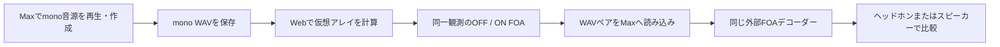
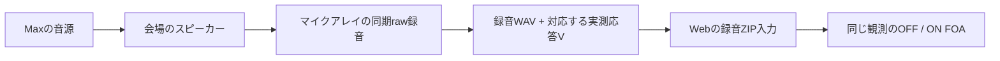

# 独自学習モデルとMaxでの比較 — v0.4.0

2026-09-11。新しい「学習モデル比較」は、物理情報と観測の時間的な特徴を使う**独自の学習済み推定器**です。マイクなしの合成実験、Maxなどで作ったmono WAVの仮想アレイ実験、実録音と対応するマイク応答の入力を分けています。OFFとONは同じ入力から一度に計算し、結果表示と保存対象を切り替えます。

**論文の公式モデルを取り込んだものでも、論文を上回ったことを示すものでもありません。** 以下の合成テストでは改善例と悪化例の両方があり、実際の会場・市販マイク・音声に対する改善は未検証です。

## まずマイクなしで使う

1. Webの「学習モデル比較」を開きます。
2. 「合成データ · マイク不要」を選び、「同じ入力で比較する」を押します。ここでは複素スペクトルの誤差を比較でき、WAVは生成しません。
3. 音で比較する場合は「MaxなどのモノラルWAV → 仮想マイク」を選び、mono WAVを読み込みます。最初は16 kHz解析・0.4秒を使います。48 kHz解析を選ぶと初期区間は0.1秒になり、20 kHzを含む帯域を扱えます。
4. OFF＝線形、ON＝独自モデルです。切り替えても入力のseed、観測ノイズ、重み、出力ゲインは変わりません。条件を変更したら再実行します。
5. 「OFF / ON 両方のFOA WAV」で同じ試行のペアを保存します。同じデコーダー、同じ出力設定、同じゲインで比較します。

初回のブラウザ実行はPython/WebAssemblyと重みの取得を行います。通常の公開版では解析はブラウザ内です。ローカルAPIモードを明示的に使った場合は、ローカルPython側で処理します。

入力区間は0.02〜5秒を指定できますが、実際には周波数×時間65,536点の上限も適用します。標準FFT 256／hop 128では16 kHzで約4秒、48 kHzで約1.3秒が目安です。長い素材は短い区間に分けます。音源WAVはmono・8〜96 kHz・32 MB以下です。

## Maxで何を送り、どう聴くか

ここで「送る」は**WAVを保存して手動で読み込む**ことです。MaxからWebへのライブ音声ストリームはありません。以前のMax連携はチャンネル選択・ミュート等の制御であり、音声の自動転送ではありません。



[実験パッチ](../max/ADEPS_Experiment.maxpat)をMax 9で開きます。操作の詳細は[Max実験手順](../max/README_EXPERIMENT.md)、確認済み／未確認の範囲は[Max検証記録](../max/EXPERIMENT_VALIDATION.md)にあります。

1. まず論理出力0・OUTPUT GAIN 0で、短い一人の発話をmono WAVとして用意します。既にファイルがあればMaxを経由せずWebへ直接読み込めます。
2. Maxで保存する場合は元音源の保存先を選び、録音開始後にSOURCE RUNをオンにします。終了時に録音を閉じてからWebへ読み込みます。保存信号は会場出力GAINより前なので、会場へ出音せず準備できます。
3. Webで仮想アレイのOFF / ONを計算し、出力ZIPを保存します。ZIPの `linear_FOA_ACN_SN3D.wav` をMaxのOFF、`enhanced_FOA_ACN_SN3D.wav` をONへ読み込みます。
4. 外部デコーダーへ `receive~ adeps-experiment.W`、`.Y`、`.Z`、`.X` を接続します。パッチにはデコーダーが含まれません。FOAはACN/SN3D・W,Y,Z,Xの4chで、4台のスピーカー出力へ直接割り当てる信号ではありません。
5. A+Bを同時に開始し、同じ再生位置のままON/OFFを比較します。パッチは20 msで重みを切り替えます。これは事前計算したファイルのA/Bで、モデルをリアルタイムに動かすトグルではありません。

入力はまず短い発話、その後にmonoの楽器、広帯域ノイズ、短い打音を使います。発話では音色・子音・定位、楽器ではアタックや音程、打音では先端と残響の変化を確認します。現在のmono入力経路は、1つの素材と17／39 msの合成反射を仮想アレイへ通すものです。別々の話者を独立した方向へ置く多音源WAV入力UIはありません。

Maxのピンクノイズ、20 Hz〜20 kHzの8秒スイープ、100 msバーストは、経路・帯域・到達を確認する素材です。スイープの逆畳み込みや厳密なIR推定はパッチに含まれません。**推定モデルで加工したスイープやIRを、スピーカー校正の正解として使いません。** Webの1 Hz表示も実機で1 Hzを出力する指定ではありません。

両方式のWAVはサンプル位置をそろえ、両出力と参照がある場合は参照も含む最大ピークから、共通の書き出しゲインを決めます。別々にピーク正規化すると振幅比較が変わるため、そのままのペアを使います。参照が書き出しゲインに含まれる場合も、参照をモデルの推定・入力正規化へは渡しません。

## マイクで会場を録音する場合

こちらはmono音源の仮想実験とは別の入力です。



必要なのは、同時刻の各カプセルの録音と、その個体・チャンネル順・規約・周波数に対応する応答行列Vです。ZIP直下に `array.json` と `microphones.wav` を置きます。任意の `reference.wav` は正しく同期したFOA参照がある場合だけ追加します。B-formatへ変換した4chや元mono音源は、変換前の各マイク信号の代わりにはなりません。

- 録音WAV：同期した4〜64ch。Max実験パッチのraw録音部は19ch固定なので、60／64ch機へそのまま適用しません。
- V：解析の周波数グリッドと一致する複素 `[F,Q,36]`。実部・虚部、real ACN/N3D、チャンネル順を明記します。4係数しかないVをゼロ埋めして36係数にしません。
- 中心座標・高さ・正面、音源位置と出力ID、収録レート・ゲイン・時計構成を記録します。再生機とUSBマイクが別クロックなら、同時に録音開始しただけでは同期やドリフトの解決になりません。
- 録音と応答の詳細は[既存の入力仕様](NEURAL_PROTOCOL.md#4-input-formats)を参照します。v0.4の新モデルだけは上記65,536点上限を使い、旧モデルは8,192点のままです。

録音自体は通常の会場でできます。マイクの応答が別途入手できれば、この録音のために無響室へ行く必要はありません。ただし、会場の反射を含む録音からマイク固有の無反射応答をそのまま取り出せるわけではありません。未取得の場合は、メーカー提供または適切な校正測定が別途必要です。

元mono音源は、マイク位置における反射込みの正しいFOAではありません。妥当な参照がない実録音では、NRMSE・coherence・SI-SDRによる「正解からの改善」を出しません。入力整合性、観測残差、再現性、同じ再生条件での聴感を記録します。観測残差が小さいだけでも復元の正しさは証明できません。

## 何を学習したか

実装は[spatial_model.py](../backend/spatial_model.py)、学習は[train_spatial_model.py](../scripts/train_spatial_model.py)、重み・学習ログは[モデルカード](../public/models/spatial-v1.json)です。

| 項目 | 同梱 `spatial-v1` |
|---|---|
| 構造 | 幅512の隠れ層4段、SiLU、複素係数の残差を予測するMLP |
| 学習済みパラメータ | 1,063,496 |
| 入力特徴 | 465実数 |
| 入出力 | 5次・36複素係数。評価・WAVは先頭4係数のFOA |
| 推論 | 1回の決定的な順伝播。拡散サンプリングなし |
| 学習 | 3,072合成シーン、各64周波数×8フレーム＝合計1,572,864ビン |
| 学習実行 | 12,000step、batch 512、初期化seed 38741 |
| 採用重み | モデル検証64シーンのFOA損失が最小だった10,400step |
| 記録した実行環境 | PyTorch 2.9.0、Apple MPS。訓練約80秒、端末一般の所要時間保証ではない |

学習用シーンは1〜5方向の平面波と拡散した係数成分を合成しています。自由空間の無指向性アレイ、4／5／6／8／12マイク、半径4〜10 cm、SNR 10〜50 dB、5次または15次の音場を使い、方向・配列の回転・音源強度・スペクトル傾斜・雑音等を変えています。**録音された音声、HARP、VCTK、WSJ0、実測した室内IRは学習していません。** 「音声に似た合成音」は実音声の学習を意味しません。

入力はまず `a_lin = E p`、`R = E V` を計算します。各周波数で、線形出力の先頭4係数を全フレームで平均したRMSを正規化尺度にします。参照はこの尺度の計算に使いません。

465特徴の内訳は、正規化した36複素係数の実部・虚部72、Rの先頭4行の実部・虚部288、Rの実対角36、対数周波数1、先頭4係数の時間共分散の実部・虚部32、36係数それぞれの観測電力36です。共分散・電力・RMSは**選択した窓の全フレーム**から求めます。将来フレームも使う非因果・オフライン処理で、ライブ音声処理の遅延保証はありません。

学習損失は正規化した複素係数の二乗誤差です。FOAの4係数は重み1、残り32係数は0.025。AdamW、初期学習率0.0008、cosine減衰で0.00004、weight decay 0.0001、勾配ノルム上限2を使います。200stepごとにモデル検証を行い、正解は学習・検証の損失と評価にだけ使います。推定APIへ正解を渡す引数はありません。

初回の397特徴モデルは検証で線形法より悪化しました。その失敗もカードの `development_trials` に残しています。最終モデルのモデル検証では、入力RMSで正規化したFOA NRMSEが線形−0.93474 dB、独自−1.33118 dBでした。この値は下記最終テストとデータ生成・正規化・集計が違うため、数値を混ぜません。

## 推論設定と、分けて保存した評価

線形符号化は `E = Vᴴ(VVᴴ + γ²I)⁻¹` を使い、`γ² = max(λ trace(VVᴴ)/Q, 1e-12)` を周波数別に計算します。UIの既定λは0.001です。

新モデルの予測を `a_pred` とすると、実装可能な後処理は次です。

```text
a_mix = a_lin + blend × (a_pred − a_lin)
a_on  = a_mix + consistency × E(p − V a_mix)
a_off = a_lin
```

[同梱の固定設定](../public/models/spatial-tuning.json)は `blend=1.0`、`consistency=0.0`。**追加の観測整合処理は適用していません。** 物理情報Rをモデルへ入力することと、推論後に観測整合を追加することは別です。設定は重みのSHA-256へ結び付け、別モデルへの誤適用を拒否します。

| 用途 | シーン数 | seed |
|---|---:|---|
| 重みの学習 | 3,072 | 10000–13071 |
| 重み選択のモデル検証 | 64 | 20000–20063 |
| 混合率・追加整合・線形正則化の調整 | 36 | 25000–25035 |
| 固定後の複素スペクトル最終テスト | 36 | 90000–90035 |
| 別の合成WAVテスト | 3 | 91000–91002 |

調整用36シーンで、blendの4候補と追加整合の3候補を比較しました。強い比較対象も用意するため、線形法のλを5候補から独立に選び、λ=0.01を固定しています。最終テストを見て重みや設定は変更していません。

最終テストは音声風・音楽風・ノイズ・過渡音の複素スペクトルに合成遅延反射を加え、マイク数4／6／12／19、SNR 15／40 dBと、別の平面配置条件を含む36シーンです。19ch条件は仮想配置であり、ZM-1の実測性能ではありません。訓練と異なる生成器・雑音スケーリングも含むため、これ自体も特定の合成分布に対する評価です。

[保存した最終評価JSON](../public/models/spatial-benchmark.json)では、各シーンのFOA複素NRMSEを求めてから、dB値の算術平均を取っています。誤差の定義は `20 log10(||推定−参照|| / ||参照||)`。小さいほど良く、改善量は「線形の誤差dB − 独自の誤差dB」です。

| 最終36シーン | 平均FOA NRMSE | 独自モデルの平均改善量 |
|---|---:|---:|
| 既定線形 λ=0.001 | −0.81802 dB | +2.36670 dB |
| 調整済み線形 λ=0.01 | −2.43603 dB | +0.74869 dB |
| 独自モデル | −3.18472 dB | — |

既定線形に対して**30シーン改善、6シーン悪化、同等0**でした。この30／6は調整済み線形に対する勝敗ではありません。平均改善量のbootstrap 95%区間は1.63264〜3.10826 dBですが、同じ合成36シーンを再抽出した範囲であり、任意の実音声や会場に対する信頼区間ではありません。

### WAVで見えた悪化も残す

別の3件は、時間波形を実際に仮想アレイへ通し、FOA WAVへ戻すテストです。NRMSEは小さいほど良く、SI-SDRは大きいほど良い指標です。SI-SDRはDC除去後のチャンネル別射影で求め、有効FOA 4chを算術平均します。

| 合成WAV | NRMSE：線形 → 独自 | SI-SDR：線形 → 独自 | 結果 |
|---|---:|---:|---|
| 倍音・16 kHz・0.4秒 | −13.5176 → −13.6592 dB | 18.5949 → 17.7776 dB | NRMSE改善、SI-SDR悪化 |
| バースト・16 kHz・0.4秒 | −16.6571 → −15.2329 dB | 17.3174 → 16.7654 dB | 両指標とも悪化 |
| チャープ・48 kHz・0.1秒 | 1.5272 → 2.0612 dB | −14.6300 → −13.2934 dB | NRMSE悪化、SI-SDR改善 |

したがって、複素スペクトル36例の平均改善だけで「音声も良くなった」とは言えません。チャープでは両方式ともSI-SDRが低く、良好な復元例とは扱いません。今回のWAV結果は、波形で学習・検証する必要性を示しています。

## 論文から採用した考え方と、異なる実装

[Amit Milstein, Nir Shlezinger, Boaz Rafaely, *Array-Agnostic Ambisonics Encoding via Diffusion Posterior Sampling*, arXiv:2608.24558v3](https://arxiv.org/html/2608.24558v3)を参照しました。マイク観測と応答Vを用いる逆問題、正則化した線形符号化、5次係数を扱ってFOAを評価する構成を参考にしています。

一方、論文は30.8MパラメータのNCSN++Mを基にした拡散priorと150回の推論を用い、HARP・VCTK・WSJ0の条件で評価しています。今回の1.063Mモデルはアレイを含む合成データから教師ありで残差を学習し、1回で予測します。配列条件を学習へ含めるため、論文と同じarray-agnosticな学習方法でもありません。旧小型MLPの拡散実験は別タブに残しています。[論文 §2–4](https://arxiv.org/html/2608.24558v3)

論文Table 1の6マイクSI-SDRは線形9.26 dB／ADEPS 16.20 dB、Table 2では9.09 dB／12.67 dBですが、**この文書のNRMSEや別素材のSI-SDRと引き算して比較できません。** 同じ入力、アレイ応答、参照、規約、指標実装で両方を実行した結果が必要です。ILD・IC・HRTFによる評価は今回の新モデルに実装していません。[論文Table 1・2](https://arxiv.org/html/2608.24558v3)

著者の公開先は名前が **ADEUPS** の[公式GitHubリポジトリ](https://github.com/Amitmils/ADEUPS)です。2026-09-11の確認ではREADMEのみで、コード公開準備中の案内があり、公式重みを取得できていません。公開前のコード・設定を推測して同じ実装と呼びません。

## 再学習と記録の再計算

利用するだけならPyTorchは不要です。再学習はローカルPythonにPyTorchを入れて行います。以下はリポジトリのルートで、同梱重みを上書きしない新しい出力先を使う例です。

```sh
python3 -m venv .venv-training
.venv-training/bin/python -m pip install -r requirements-training.txt
.venv-training/bin/python scripts/train_spatial_model.py \
  --steps 12000 --seed 38741 --hidden 512 \
  --train-scenes 3072 --validation-scenes 64 \
  --chunk-scenes 512 --chunk-steps 2000 --batch-size 512 \
  --device mps --output work/retrain-spatial-v1
```

MPSを使わない環境では `--device cpu` にします。重み、カード、PyTorchとNumPyの一致検査を出力します。`--output` の既存ファイルは学習スクリプトが上書きするので、再試行ごとに新しいディレクトリを指定してください。PyTorch・端末による数値差があるため、同じseedでも重みのバイト単位の一致は保証しません。

`--previous-trial path/to/card.json` は過去の試行記録を新カードへ添付する任意オプションで、学習データへは入力しません。公開カードには初回失敗の記録が含まれています。別ディレクトリの重みを作ってもWebの同梱モデルは自動で置き換わりません。

同梱重みの固定済み評価を再計算する例は次です。出力先には新しいファイル名を指定します。

```sh
.venv-training/bin/python scripts/benchmark_spatial.py evaluate \
  --output work/recheck-spatial-benchmark.json
```

このコマンドは `public/models/spatial-tuning.json` を読み、固定済みの重み・設定を同じテストに再適用します。`tune --output work/recheck-spatial-tuning.json` は調整用36シーンを再計算しますが、`evaluate` が読む同梱設定ファイルを自動で切り替えるものではありません。モデル改良を始めたら、既に見た最終テストへの過適合を避け、新しい独立評価の入力を先に固定する必要があります。

Pythonとブラウザの推論は同じNumPy実装を使い、重みをSHA-256で照合します。専用テストには入力だけによる正規化・共分散、ゼロ残差が線形と同じになること、改変重みの拒否、実学習重みのPyTorch／NumPy一致を含めています。これは音響現場での品質の保証ではありません。

公開用ブラウザとネイティブPythonの比較では、合成入力33,290数値の最大差5.97×10⁻⁶、mono WAV入力105,802数値の最大差5.04×10⁻⁶で、許容差 `1e-5 + 1e-4 × |native|` の失敗は0でした。UIから保存したZIPの6本のWAVも4ch・16 kHz・6,400サンプルと確認しています。[ブラウザ検証記録](spatial-browser-verification.json)、[ローカルAPI検証記録](spatial-api-verification.json)に詳細を保存しています。

## 次に品質を上げるために必要なこと

今回まだ確認できていないのは、実音声と実測応答に対する改善です。まず発話・楽器・過渡音のWAV評価を増やし、波形と時間・周波数の構造を学習するモデル、実測したマイク応答、未使用の話者・部屋・アレイを組み合わせた比較へ進みます。公式モデルが公開された場合は同じ入力で追加評価します。

現段階の到達点は「動作する独自学習モデルと、改善も悪化も残す比較環境」です。論文の精度の完全再現、論文超え、実会場のスピーカー自動校正、連続リアルタイム処理は未達です。
