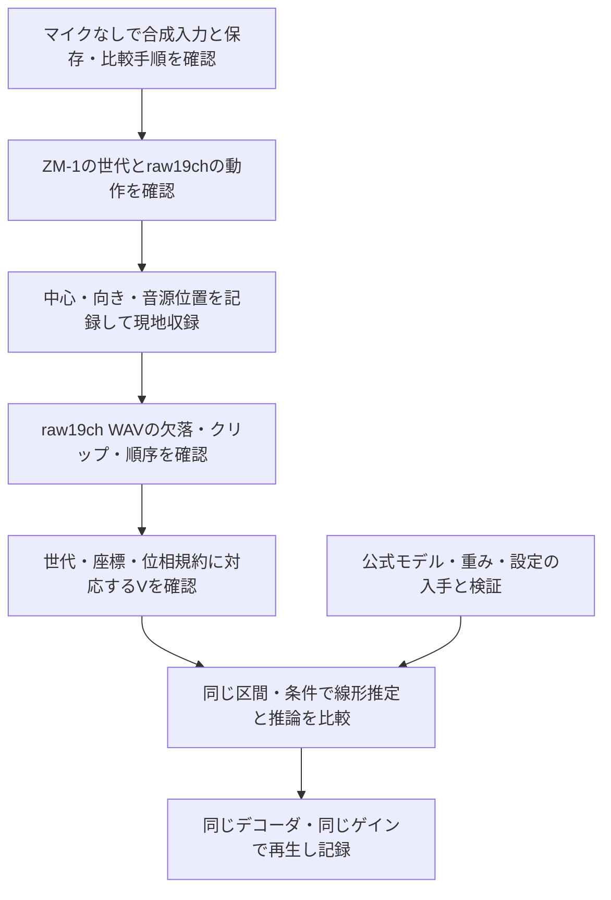

# ZM-1を使う実験の準備と現地収録

更新日：2026年9月11日。この文書は、会場の実音をZM-1で収録し、Ambisonics推定を比較するための手順です。特定施設の機材設定や座標は含みません。

**マイクがなくても、入力形式の確認、合成データによる計算、結果保存、比較再生の準備まで進められます。** 会場での効果を判断するには、実際のraw録音、そのZM-1に適した応答行列V、評価方法の確認が必要です。現在の小型モデルによる結果は、論文の性能再現を意味しません。[実装範囲](NEURAL_PROTOCOL.md)

今回追加したローカル準備ツールは、**公式モデルも小型ニューラルモデルも実行しません**。公開実測応答の確認、未使用方向でのモデル近似誤差、raw19chファイルの整合検査、線形FOA出力までを扱います。Web UIは変更していません。

## ローカル準備ツールの使い方

プロジェクトのルートで、使用するPython環境に `requirements-zm1.txt` をインストールします。

```sh
python3 -m pip install -r requirements-zm1.txt
python3 scripts/prepare_zm1.py audit --sofa /path/to/Zylia_ZM1_Directivity.sofa --out work/zm1-audit
python3 scripts/prepare_zm1.py inspect /path/to/raw19.wav
```

`audit` はSHA256で照合したIEM公開SOFAだけを読みます。576方向のうち460方向で実験用Vを作成し、残り116方向で近似誤差を検査します。`response-audit.png`、`response-audit.json`、`response-profile.json`、`recording-notes-template.json`と、模擬入力ZIP・線形FOA WAVが出力されます。模擬入力は生成ノイズを未使用方向の実測IRへ通したもので、新しい会場録音ではありません。出力先が既存なら上書きしません。

現地録音を準備する際は、`inspect` でraw19ch・48kHz・無音・フルスケール・完全重複チャンネルを確認します。この検査だけではマイクの校正や以前の録音経路でのクリップは判定できません。購入個体との応答一致は未確認であることを理解し、WAVとSOFAのチャンネル順を確認できた場合のみ、次の実験用変換を行います。`3E`は実際の世代へ変更します。

```sh
python3 scripts/prepare_zm1.py pack /path/to/raw19.wav \
  --profile work/zm1-audit/response-profile.json --out work/recorded-input.zip \
  --start 0 --duration .1 --device-generation 3E \
  --confirm-sofa-channel-order --accept-unverified-response
```

このプロファイルは48kHz／FFT256／hop128専用です。既定の短区間は0.1秒で、音声品質を結論づける長さではありません。現在の8192周波数時間点の制限に合わせた入出力確認です。16kHzへ切り替える場合は別の対応Vが必要で、このプロファイルを流用しません。元録音は保持し、録音ファイルのSHA256と区間を変換先に記録します。

公開IRは128サンプル、約2.67msです。ゼロ埋めで周波数点を増やしても計測の分解能は増えません。図は1Hz〜20kHzを表示しますが、その帯域の測定精度を保証しません。公開ページとSOFA内の権利表記が一致しないため、原本・実測からの派生プロファイル・模擬入力はローカルに保管し、再配布しません。



## 1. いま進められることと、必要な実物

| 作業 | マイクなしで進める範囲 | 追加で必要になるもの |
|---|---|---|
| 操作と計算の確認 | 「ニューラル推論」の合成データを実行し、線形との比較・残差・結果JSONを保存 | 不要。合成試験の結果として扱う |
| WAVの保存・比較 | 「合成WAV例を選ぶ」で4ch FOAを書き出し、同じデコーダで再生 | ヘッドフォンなど。会場の再現精度はまだ評価できない |
| 収録計画 | 音源、記録項目、ファイル名、音源を鳴らす順番、評価用の別テイクを決める | 現地での位置・配線確認 |
| ZM-1応答の準備 | 公開測定資料の入手先、形式、利用条件と世代の対応を調べる | 購入個体の世代確認、必要なら応答測定 |
| 実録音の入力確認 | 合成ファイルでチャンネル数・形式・処理区間を確認 | ZM-1と同期したraw19ch録音 |
| 会場の音の評価 | 評価項目と再生方法を決める | 実録音、適切なV、現地での比較 |
| 論文と同じモデルの評価 | 必要な条件・不足資料を整理する | 公式モデル・重み・設定・評価資料の公開または提供 |

合成データを会場名や実測データとして扱わないでください。グラフが1 Hz〜20 kHzを表示していても、その全帯域での実測精度を検証したことにはなりません。

## 2. 購入前に確認すること

1. **本体の世代を確認する。** ZM-1には1C・1D・3Eがあり、筐体とマイク素子が異なります。商品名が「STANDARD」「MUSIC」「PRO」だけでは世代を特定できません。本体ラベル、シリアル、設定画面などで確認し、不明なら不明のまま記録します。[メーカーの世代比較](https://support.zylia.co/kb/differences-between-zylia-zm-1-models/)
2. **raw19chの動作を確認する。** ステレオ試聴だけで判断せず、短い19ch WAVと全チャンネルの入力メーターで、無音チャンネルや途切れがないか確認します。全chの信号が完全に同じなら、ステレオ等を複製したファイルでないかも調べます。
3. **USB端子・ケーブル・スタンドとソフトの扱いを確認する。** 中古の場合は登録やライセンス移管の条件も確認します。PROのソフトが付かなくても、対応ドライバーとDAWからraw入力を録る経路はあります。通常のB-format変換を比較相手に使う場合は、対応する変換ソフトを別途用意します。[メーカーの初期設定](https://www.zylia.co/get-started.html)、[raw録音の説明](https://support.zylia.co/)
4. **公開応答と世代が対応するか確認する。** IEMの公開資料「High-resolution directional impulse responses of the Zylia ZM-1」は調査対象になりますが、同名のZM-1というだけで購入個体に一致するとは扱いません。世代・チャンネル順・角度・時間基準・利用条件を確認してから採用します。[公開資料](https://phaidra.kug.ac.at/o:91937)

## 3. 買った後、まず手元で録音する

ZM-1をUSBでMacに接続します。録音のために別の19chオーディオインターフェースやZR-1を用意する必要はありません。[メーカー製品説明](https://www.zylia.co/shop/zylia-pro-have-it-all-zylia-pro-have-it-all-216)

1. MacのOSに対応する公式ドライバーをインストールします。確認時点のUniversal版はv3.0.0、macOS 12以降対応です。OS更新時は公式対応条件を再確認します。[公式ドライバー](https://www.zylia.co/zylia-zm-1-drivers.html)
2. 19chを同時に扱えるDAW、またはZYLIA StudioでZM-1を入力に選びます。録音設定は**48 kHz・24 bitのraw19ch WAV**を基本にします。DAWが32 bit floatで保存する場合も元録音を保持し、保存形式を記録します。
3. DAW側のEQ、コンプレッサー、ノイズ除去、ゲート、リミッター、ノーマライズを録音経路から外します。チャンネルごとにゲインや遅延を変えません。メーカー内部の校正を無効化する指示ではありません。
4. 音声を短く録り、19chすべてに信号があり、クリップや途切れがないことを確認します。ゲイン設定を記録して固定します。低い録音レベルを補う目的で、チャンネルを個別にノーマライズしないでください。
5. Studioで書き出す場合は、**RAW／19-ch WAV**を選びます。Stereo、楽器分離トラック、変換後B-formatはraw19chの代わりになりません。[公式の書き出し手順](https://support.zylia.co/kb/sound-files-export/)

この段階の合格は「再解析できる素材が録れた」です。空間推定の精度や会場補正が確認できたという意味ではありません。

## 4. 現地で行う最初の収録

以下の順序と秒数は、この試作のための実務上の提案です。論文の収録手順を再現したものではありません。

### 設置と位置の記録

- 三脚でZM-1を固定し、**マイク球の中心位置**を測ります。床からの高さ、会場内の基準点からのX・Yも記録します。
- 基準となる正面をテープや写真で残し、正面方向・傾き・回転を記録します。ATFで使う機器座標と、会場座標の対応を決めます。ロゴの向きを未確認のまま座標軸に読み替えないでください。
- 試験するスピーカーごとにID、実際に鳴る出力、位置を確認します。既存の設計座標があっても、ファイルの設定値と実際の設置位置・配線は現地で照合します。
- スピーカー位置と、球の中の19カプセルの位置は別です。前者は試験音源の方向や再生系を記述し、後者と機器応答はマイクのVを記述します。

### 最小の収録セット

| テイク | 内容 | 目的 |
|---|---|---|
| 静かな状態 | 同じゲインで10秒程度 | 暗騒音、空調や常時音の把握 |
| 1音源の発話 | 位置が分かるスピーカー1台から同じ音声を20〜30秒程度再生 | 簡単な条件で推定方向・音色を比較 |
| 別方向の発話 | 異なるスピーカーを1台ずつ、同じ音声・同じ設定で再生 | 方向を変えた場合の再現性を確認 |
| 評価用の別テイク | 条件調整に使わなかった発話や位置を残す | 調整に使った録音だけへの過適合を避ける |
| 任意の追加試験 | 2音源、音楽、イベントに近い音 | 応用条件を調べる。論文の音声評価と分けて報告 |

最初は声と1音源から始めます。再生は会場担当者と決めた音量で行い、録音のために大きな音量を出す必要はありません。室内の人数、扉、空調、DSP設定もテイク間で変えた場合は記録します。

元の再生音声を保存しておくと、内容・時刻・再生条件の確認に役立ちます。ただし、そのモノラル音声は**マイク位置での正解FOAではありません**。会場の反射を含む正解Ambisonicsを持たない録音に、正解があるものとしてSI-SDR等を付けないでください。

### 残すメタデータ

| 項目 | 記録内容 |
|---|---|
| 機器 | ZM-1の世代、シリアル、ドライバー、OS、録音アプリの版 |
| 音声 | 元ファイル名、48 kHz、保存bit形式、19ch、ch順、録音ゲイン、録音開始時刻 |
| 座標 | 使用単位、会場の原点と軸、マイク中心、機器の正面と傾き、各音源の位置 |
| 再生 | 音源ID、再生ファイル、再生機器、出力ch、再生ゲイン、DSP条件 |
| 室内 | 人数、扉、空調、移動物、異音、テイク中の変更 |
| 応答 | ATF/Vの出典、対象世代、ch対応、角度・位相・時間・SH規約、未確認事項 |
| 解析 | 使用区間、解析サンプルレート、FFT、モデルと重みの識別子、推論条件 |

元録音はそのまま保管し、短区間の切り出しや変換は別ファイルに保存します。機器シリアル、写真、会場座標、収録した声は、公開デモへ自動的に含めないでください。

## 5. 録音を推定に使うまで

**raw録音と応答Vの両方が必要です。** B-formatに変換できること、個別カプセルの感度校正、通常の室内インパルス応答は、それぞれVが用意できたことと同義ではありません。

1. raw19chのチャンネル順・サンプル数・レベル・欠落を確認します。元のch順を維持します。
2. 採用するVが、その機器世代・チャンネル・方向・位相規約を表し、解析の周波数点に対応していることを確認します。現行入力のVは`[F, Q, 36]`です。19chのZM-1では`Q=19`になります。球面筐体の影響を無視した自由空間・無指向性モデルを、測定済みZM-1の応答として扱わないでください。
3. 現行アプリの録音ZIPは直下の`microphones.wav`と`array.json`で構成します。形式と制限は[NEURAL_PROTOCOLのInput formats](NEURAL_PROTOCOL.md#4-input-formats)を参照します。対応Vの確認が終わるまで、形式が通るだけの推論結果を実機評価として扱いません。
4. 最初は既定の16 kHz解析・0.4秒など、短い区間で入力と出力を確認します。元の48 kHz録音は残します。16 kHz解析の上限は8 kHzであり、20 kHzまで検討する場合は48 kHz解析と適切なVが必要です。処理区間・FFTの上限も守ります。
5. 線形推定と推論で同じ入力、V、区間、規約を使います。参照がない場合は残差、入力診断、反復履歴と聴感を記録し、参照品質スコアを捏造しません。
6. FOAを同じAmbisonicsデコーダ、同じ再生系、同じゲインで比較します。ACNのFOA順はW,Y,Z,Xです。N3D／SN3Dをデコーダと合わせます。**4ch FOAを4台のスピーカーへそのまま割り当てません。**

ZYLIAの通常エンコーダとの比較も可能ですが、その出力は比較対象です。独立した正解音場ではありません。音源方向との整合や残差が改善しても、それだけで音場全体の復元精度が証明されるわけではありません。

## 6. スピーカー測定・補正と、論文のモデル

スピーカーのゲイン・遅延・EQを整えるGLMのような作業と、マイク信号からAmbisonicsを推定するADEPSは別の処理です。現行ADEPS-testは、会場のスピーカーを自動測定・自動補正しません。付属Maxパッチもルーティング確認用であり、公式ADEPSモデルのリアルタイム実行や補正フィルター適用を行うものではありません。[README](../README.md)

音響応答を測る場合は、既知の試験信号、再生・録音のタイミング、クロック差、基準レベルを管理する測定手順を別に用意します。ZM-1は再生インターフェースと別の内部クロックで動き、同じPCにつないだだけではサンプル単位の同期が保証されません。ZM-1Sのタイムコードも、共通ワードクロック入力とは異なります。[メーカーFAQ](https://support.zylia.co/)

論文と同じ品質を目指すには、公式モデルと設定を入手し、既知の入力・参照出力で動作を照合し、論文の評価条件を再現した後で、会場収録へ進める必要があります。**2026年9月11日の確認対象revisionでは、著者の公開リポジトリはREADMEのみ**です。実行可能な公式モデル・学習済み重み・完全な設定は取得できていません。[著者リポジトリの確認revision](https://github.com/Amitmils/ADEUPS/tree/5076f163a1f939c297b55a39b2d9d33e2b224a5f)

このプロジェクトの24,072パラメータの独立小型priorは、論文の30.8Mパラメータのモデルや学習データを再現していません。ZM-1購入によってこの差が解消されることもありません。新しい実録音は、まず保存と入力検証に使い、公式モデル入手後にも再利用できるよう条件を残します。[論文](https://arxiv.org/abs/2608.24558v2)、[モデルの実装条件](NEURAL_PROTOCOL.md)
